# 实验一 **Hybrid Images**

## 1. 实验要求

编写图像滤波函数，将一张图片的高频部分（细节）与另一张图片的低频部分（轮廓）相叠加，形成混合图像。

## 2. 实验原理

### 2.1 相关

将图像记为$F$, $H$表示权重核（大小为$(2K+1)\times (2K+ 1)$）, 输出图像记为$G$，则
$$
G[i, j]=\sum_{u=-k}^{k} \sum_{v=-k}^{k} H[u, v] F[i+u, j+v]
$$
即
$$
G=H \otimes F
$$

### 2.2 卷积

卷积与相关类似，相当于把互相关的卷积核上下、左右翻转后进行相关操作
$$
G[i, j]=\sum_{u=-k}^{k} \sum_{v=-k}^{k} H[u, v] F[i+u, j+v]
$$
即
$$
G=H * F
$$

### 2. 3 低通/高通滤波

高斯滤波器是图像处理中常用的低通滤波器，其定义为
$$
G_{\sigma}=\frac{1}{2 \pi \sigma^{2}} e^{-\frac{\left(x^{2}+y^{2}\right)}{2 \sigma^{2}}}
$$
将原图像与一个高斯滤波器卷积，得到一个平滑后的图像（保留低频部分）

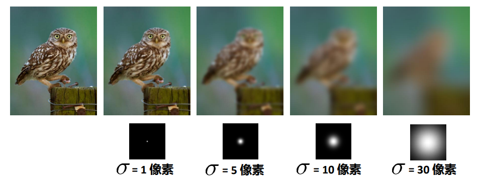

（第一讲课件P34）

令原图减其平滑后的结果，则可得到细节（保留高频部分）

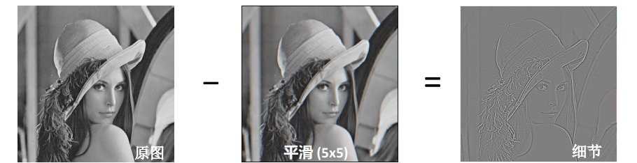

（第一讲课件P37）

## 3. 实验步骤

### 3.1 实现`cross_correlation_2d`函数

#### 3.1.1 检查卷积核的尺寸

​        根据要求，卷积核的维度为二维，尺寸为$m\times n$ ，其中$m$和 $n$必须为奇数，这样是为了保证**锚点**（中心点）有且仅有一个，刚好为图片的中心。

```python
def check_odd(kernel):    
    """
    检查卷积核的维度是否全为奇数
    """
    
    for i in range(2):        
        if not kernel.shape[i] % 2:            
            raise Exception("Both m or n should be osdd.") 
```

#### 3.1.2 处理图片维度

​        如果图片为彩色，则视为三通道（RGB）；如果图片为黑白，则视为单通道。读取图片后，图片的存在方式为三维数组（`ndarray`）其尺寸为$m\times n\times c$，其中，$c$为通道数。

```python
if len(img.shape) == 2:    
    img = np.expand_dims(img, axis=-1)
# ch为通道数
ch = img.shape[-1]
# 准备输出的图片
result_img = np.zeros(shape=img.shape)
```

​        根据卷积的定义，可以确定输出图片的尺寸
$$
N_{out}=\frac{N_{in}-F+2 P}{S}+1
$$
​        其中，$F$为卷积核的尺寸（奇数），$P$为填充的像素数，$S$为每次移动的步长，对于本次实验，$S=1$；为了使输出图片的尺寸与输入保持一致，经计算
$$
P=\frac{F-1}{2}
$$
​        即边缘填充$\frac{F-1}{2}$个像素。

```python
def zero_pad(img, kernel):
    w_pad = int((kernel.shape[0] - 1) / 2)
    h_pad = int((kernel.shape[1] - 1) / 2)
    img_pad = np.pad(img, ((w_pad, w_pad), (h_pad, h_pad), (0, 0)),\
                     str('constant'))

    return img_pad
```

```python
# 全0填充 转置
img = zero_pad(img, kernel).transpose((2, 0, 1))
```

#### 3.1.3 实现互相关

​        根据互相关的定义

$$
G[i, j]=\sum_{u=-k}^{k} \sum_{v=-k}^{k} H[u, v] F[i-u, j-v]
$$
​        需要两重循环，但是由于存在第三个维度，即通道数，所以最终操作需要三重循环。

```python
for k in range(ch):    
    for j in range(img.shape[2] - kernel.shape[1] + 1):        
        for i in range(img.shape[1] - kernel.shape[0] + 1):       
            result_img[i, j][k] = (img[k, i:(i + kernel.shape[0]),\
                                       j:(j + ernel.shape[1])] * kernel).sum()
# 如果图片为单通道，则结果去掉第三个维度
result_img = np.squeeze(result_img)
```

### 3.2 实现`convolve_2d`函数

​        根据卷积和互相关的定义可知，卷积与互相关的区别在于，卷积相当于把互相关的卷积核上下、左右翻转后进行互相关操作。

```python
def convolve_2d(img, kernel):
    kernel = np.flip(kernel)
    return cross_correlation_2d(img, kernel)
```

### 3.3 实现`gaussian_blur_kernel_2d`函数

​        根据二维高斯函数的定义，实现函数`gaussian_function`：

```python
def gaussian_function(x, y, sigma):
    pi = 3.1415926
    return (1 / (2 * pi * sigma ** 2) * np.exp(-1 * (x ** 2 + y ** 2) / (2 * sigma ** 2))
```

​        生成特定维度的高斯核，并将卷积核内的数值标准化至$(0,1)$区间之内。

```python
kernel = np.zeros(shape=(width, height))
# 确定中心坐标
center_x = np.floor(width / 2)
center_y = np.floor(height / 2)
# 生成高斯核
for i in range(width):
    for j in range(height):
        kernel[i, j] = gaussian_function(i - center_x, j - center_y, sigma)
# 标准化
kernel = kernel.sum()
```

### 3.4 实现`low_pass`函数

​        将图片与高斯核做卷积得到图片的低频部分。

```python
def low_pass(img, sigma, size):
    kernel = gaussian_blur_kernel_2d(sigma, size, size)
    img = convolve_2d(img, kernel)
    return img
```

### 3.5 实现`high_pass`函数

​        将原图减掉低频部分，即得到图片的高频部分。

```python
def high_pass(img, sigma, size):
    kernel = gaussian_blur_kernel_2d(sigma, size, size)
    img = img - convolve_2d(img, kernel)
    return img
```

## 4. 实验结果

**猫-狗合成**

高频部分：猫

低频部分：狗

<div align=center>
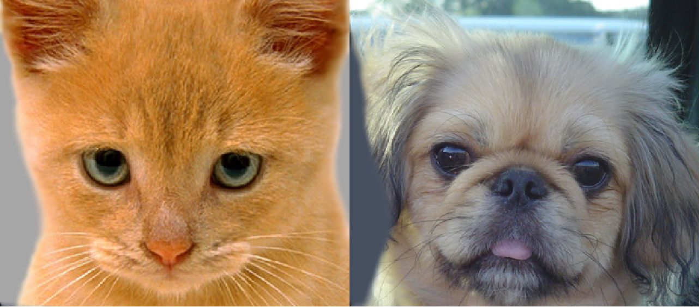
</div>


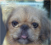


**悲伤-开心合成**

高频部分：悲伤

低频部分：开心

<div align=left>
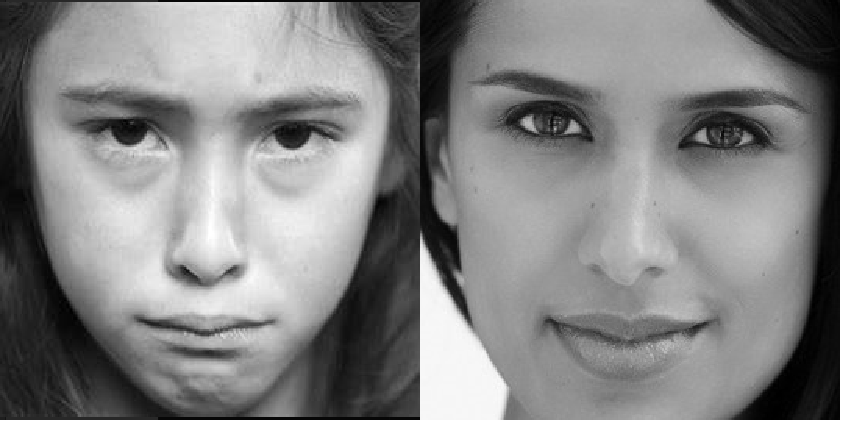
</div>


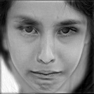


**自行车-摩托车合成**

高频部分：自行车

低频部分：摩托车

<div align=center>
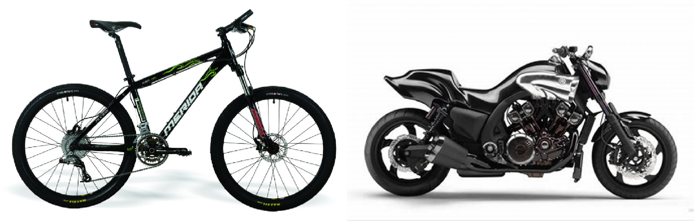
</div>

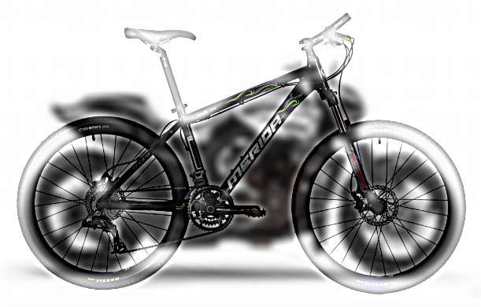

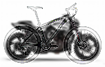

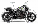


## 5. 问题讨论

​        根据课堂中所讲的标准差$\sigma$对输出图像的影响可知，当$\sigma$越大，图像越模糊，低通效果越强。


（第一讲课件P34）

​        本次实验中还有一个重要的参数，卷积核大小$F$。现在从两个方面讨论卷积核大小对实验结果的影响：计算复杂度和滤波效果。

### 5.1 计算复杂度

​        假设输入图片的尺寸为$m\times n$卷积核的长和宽均为$F$。对于输出图像的每一个像素，都是由两个矩阵对应元素相乘再相加得到的，需要进行$F^{2}+1$次浮点数运算；由于输出图片与输入图片的尺寸相同，所以对于整张图片共需要进行$m n\left(F^{2}+1\right)$次浮点数运算。所以，在非必要的情况下应是卷积核尽量小。

### 5.2 滤波效果

下列各图展示了不同卷积核大小对高/低通滤波效果的影响（标准差$\sigma=5$保持不变）

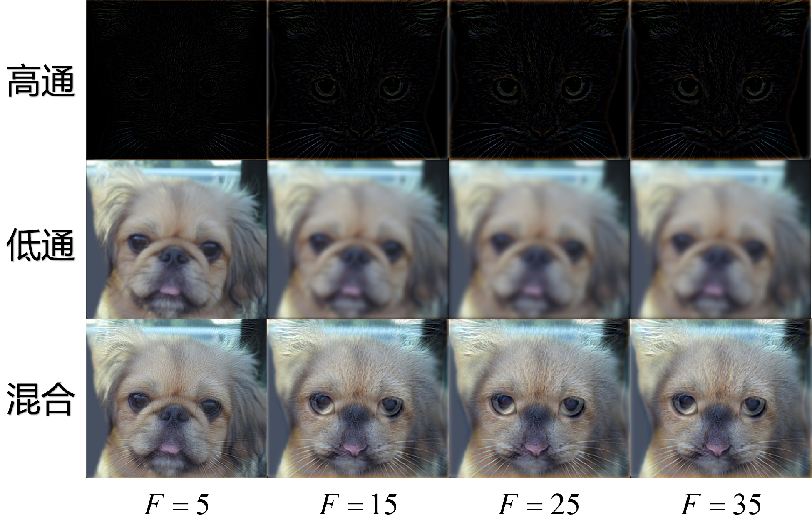

​        由图可知，当卷积核过小时，滤波效果不好；但是当卷积核过大时，对滤波效果的提升却较小。

​        实际上，当$F>3\sigma$时，除卷积核靠近中心的区域数值不变，靠近边缘的区域的数值几乎为零，所以高斯核卷积的效果大致是相同的，然而较大卷积核会造成更大量的计算，这显然是不经济的。所以，应选择大小适中的卷积核。

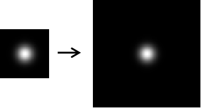

## 6. 参数说明

卷积核大小$F$：$15\times15$

标准差$\sigma$：$5$

（高通滤波器与低通滤波器参数设置一致）

混合比：$1:1$

## 7. 实验环境

**编程环境**

Python 2.7.16

**依赖库**

- numpy
- cv2
- Tkinter

## 8. `hybrid.py`全部代码

```python
# coding=utf-8
from __future__ import division
from __future__ import print_function
from __future__ import unicode_literals

import sys

sys.path.append('/Users/kb/bin/opencv-3.1.0/build/lib/')

import numpy as np


def check_odd(kernel):
    """
    检查卷积核的维度是否全为奇数
    """
    for i in range(2):
        # print(kernel.shape)
        if not kernel.shape[i] % 2:
            raise Exception("Both m or n should be odd.")


def zero_pad(img, kernel):
    w_pad = int((kernel.shape[0] - 1) / 2)
    h_pad = int((kernel.shape[1] - 1) / 2)
    img_pad = np.pad(img, ((w_pad, w_pad), (h_pad, h_pad), (0, 0)), str('constant'))

    return img_pad


def gaussian_function(x, y, sigma):
    pi = 3.1415926
    return (1 / (2 * pi * sigma ** 2)) * np.exp(-1 * (x ** 2 + y ** 2) / (2 * sigma ** 2))


def cross_correlation_2d(img, kernel):
    """Given a kernel of arbitrary m x n dimensions, with both m and n being
    odd, compute the cross correlation of the given image with the given
    kernel, such that the output is of the same dimensions as the image and that
    you assume the pixels out of the bounds of the image to be zero. Note that
    you need to apply the kernel to each channel separately, if the given image
    is an RGB image.

    Inputs:
        img:    Either an RGB image (height x width x 3) or a grayscale image
                (height x width) as a numpy array.
        kernel: A 2D numpy array (m x n), with m and n both odd (but may not be
                equal).

    Output:
        Return an image of the same dimensions as the input image (same width,
        height and the number of color channels)
    """

    check_odd(kernel)
    if len(img.shape) == 2:
        img = np.expand_dims(img, axis=-1)

    ch = img.shape[-1]
    result_img = np.zeros(shape=img.shape)
    # 为后续处理方便
    img = zero_pad(img, kernel).transpose((2, 0, 1))

    for k in range(ch):
        for j in range(img.shape[2] - kernel.shape[1] + 1):
            for i in range(img.shape[1] - kernel.shape[0] + 1):
                result_img[i, j][k] = (img[k, i:(i + kernel.shape[0]), j:(j + kernel.shape[1])] * kernel).sum()
    result_img = np.squeeze(result_img)

    return result_img


def convolve_2d(img, kernel):
    """Use cross_correlation_2d() to carry out a 2D convolution.

    Inputs:
        img:    Either an RGB image (height x width x 3) or a grayscale image
                (height x width) as a numpy array.
        kernel: A 2D numpy array (m x n), with m and n both odd (but may not be
                equal).

    Output:
        Return an image of the same dimensions as the input image (same width,
        height and the number of color channels)
    """
    kernel = np.flip(kernel)
    return cross_correlation_2d(img, kernel)


def gaussian_blur_kernel_2d(sigma, height, width):
    """Return a Gaussian blur kernel of the given dimensions and with the given
    sigma. Note that width and height are different.

    Input:
        sigma:  The parameter that controls the radius of the Gaussian blur.
                Note that, in our case, it is a circular Gaussian (symmetric
                across height and width).
        width:  The width of the kernel.
        height: The height of the kernel.

    Output:
        Return a kernel of dimensions height x width such that convolving it
        with an image results in a Gaussian-blurred image.
    """
    kernel = np.zeros(shape=(height, width))

    # 确定中心坐标
    center_x = np.floor(width / 2)
    center_y = np.floor(height / 2)

    for i in range(width):
        for j in range(height):
            kernel[j, i] = gaussian_function(i - center_x, j - center_y, sigma)
    # 标准化
    kernel = kernel / kernel.sum()

    return kernel


def low_pass(img, sigma, size):
    """Filter the image as if its filtered with a low pass filter of the given
    sigma and a square kernel of the given size. A low pass filter supresses
    the higher frequency components (finer details) of the image.

    Output:
        Return an image of the same dimensions as the input image (same width,
        height and the number of color channels)
    """
    kernel = gaussian_blur_kernel_2d(sigma, size, size)
    img = convolve_2d(img, kernel)
    return img


def high_pass(img, sigma, size):
    """Filter the image as if its filtered with a high pass filter of the given
    sigma and a square kernel of the given size. A high pass filter suppresses
    the lower frequency components (coarse details) of the image.

    Output:
        Return an image of the same dimensions as the input image (same width,
        height and the number of color channels)
    """
    kernel = gaussian_blur_kernel_2d(sigma, size, size)
    # print(g)
    img = img - convolve_2d(img, kernel)
    return img


def create_hybrid_image(img1, img2, sigma1, size1, high_low1, sigma2, size2,
                        high_low2, mixin_ratio):
    """This function adds two images to create a hybrid image, based on
    parameters specified by the user."""
    high_low1 = high_low1.lower()
    high_low2 = high_low2.lower()

    if img1.dtype == np.uint8:
        img1 = img1.astype(np.float32) / 255.0
        img2 = img2.astype(np.float32) / 255.0

    if high_low1 == 'low':
        img1 = low_pass(img1, sigma1, size1)
    else:
        img1 = high_pass(img1, sigma1, size1)

    if high_low2 == 'low':
        img2 = low_pass(img2, sigma2, size2)
    else:
        img2 = high_pass(img2, sigma2, size2)

    img1 *= 2 * (1 - mixin_ratio)
    img2 *= 2 * mixin_ratio
    hybrid_img = (img1 + img2)
    return (hybrid_img * 255).clip(0, 255).astype(np.uint8)

```

