# 实验二 Feature Detection

## 1. 实验要求

编写函数实现检测图像中的特征点，并在另一个图像中找到最佳匹配特征。

## 2. 实验原理

### 2.1 Harris 角点检测

对于图像中的每个点，考虑该点周围的像素窗口，计算该点的Harris矩阵$H$，定义为
$$
\begin{aligned} H &=\sum_{p} w_{p} \nabla I_{p}\left(\nabla I_{p}\right)^{\top} \\ &=\sum_{p} w_{p}\left(\begin{array}{cc}{I_{x_{p}}^{2}} & {I_{x_{p}} I_{y_{p}}} \\ {I_{x_{p}} I_{y_{p}}} & {I_{y_{p}}^{2}}\end{array}\right) \\ &=\sum_{p}\left(\begin{array}{cc}{w_{p} I_{x_{p}}^{2}} & {w_{p} I_{x_{p}}} \\ {w_{p} I_{x_{p}} I_{y_{p}}} & {w_{p} I_{y_{p}}^{2}}\end{array}\right) \\ &=\left(\begin{array}{cc}{\sum_{p} w_{p} I_{x_{p}}^{2}} & {\sum_{p} w_{p} I_{x_{p}} I_{y_{p}}} \\ {\sum_{p} w_{p} I_{x_{p}} I_{y_{p}}} & {\sum_{p} w_{p} I_{y_{p}}^{2}}\end{array}\right) \end{aligned}
$$

使用Harris矩阵$H$计算每个像素处的角点强度函数$c(H)$为
$$
c(H)=det(H)-0.1[trace(H)]^2
$$

再根据偏导数求出特征点的方向角
$$
\theta=\tan ^{-1}\left(\frac{\partial f}{\partial y} / \frac{\partial f}{\partial x}\right)
$$

### 2.2 MOPS特征描述符

通过放射变换将特征点周围的$40×40$大小的像素区域子采样为$8×8$大小的图像块


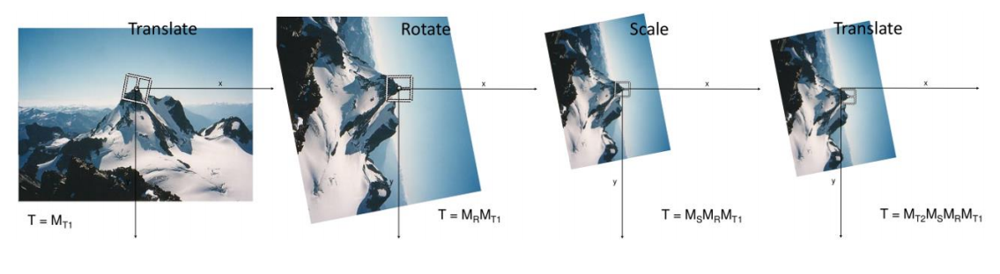


基本的仿射变换有

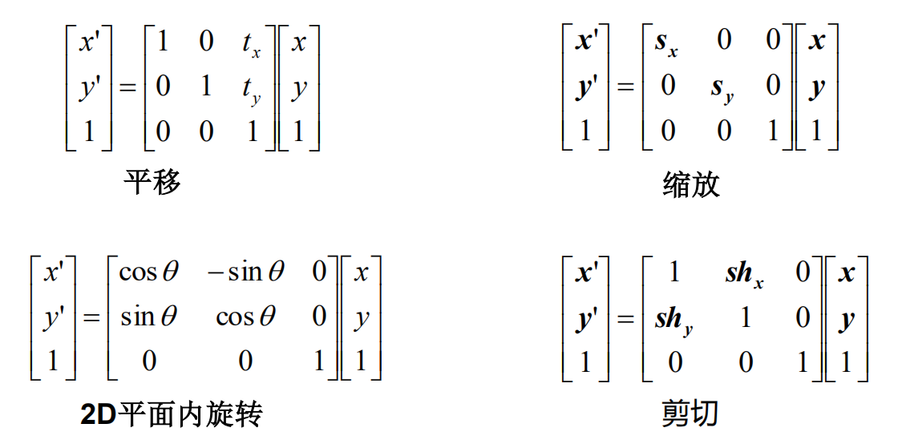
（第7讲课件P19）


### 2. 3 特征匹配

​        通过比较两个特征之间的标量距离实现特征匹配，定义两个距离函数

平方差之和（SSD）
$$
L=\left\|f_{1}-f_{2}\right\|
$$

比率测试，即最接近的特征匹配的SSD距离除以第二接近的特征匹配的SSD距离
$$
R=\frac{\left\|f_{1}-f_{2}\right\|}{\left\|f_{1}-f_{2}\right\|}
$$


## 3. 实验步骤

### 3.1 计算角点强度响应


​        使用`scipy.ndimage.sobel`函数分别求出$x$和$y$方向的导数（差分）$I_{x}^{2}$和$I_{y}^{2}$

```python
dx = sobel(srcImage, axis=1)
dy = sobel(srcImage, axis=0)
# 或使用cv2.Sobel
# dx = cv2.Sobel(srcImage, -1, dx=1, dy=0, ksize=3, borderType=cv2.BORDER_REFLECT)
# dy = cv2.Sobel(srcImage, -1, dx=0, dy=1, ksize=3, borderType=cv2.BORDER_REFLECT)
```


​        进而计算出方向角
```python
orientationImage = np.arctan2(dy, dx) * 180 / np.pi
```

​        使用`scipy.ndimage.gaussian_filter`函数分别对$I_{x}^{2}$、$I_{y}^{2}$和$I_{x} I_{y}$进行高斯模糊，相当于对每个点都乘以一个权重$w$
```python
dxx = gaussian_filter(dx*dx, sigma=0.5)
dyy = gaussian_filter(dy*dy, sigma=0.5)
dxy = gaussian_filter(dx*dy, sigma=0.5)
```

​       最后根据角点强度函数的公式
$$
c(H)=det(H)-0.1[trace(H)]^2
$$
​        得到每个像素点的响应值

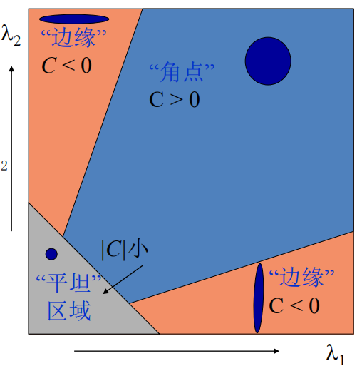

​        响应值大于0的像素点即为角点

```python
for i in range(0, width):
    for j in range(0, height):
        a = dxx[i, j].astype(np.float32)
        b = dxy[i, j].astype(np.float32)
        c = dyy[i, j].astype(np.float32)
        harrisImage[i, j] = (a * c - b * b) - 0.1 * np.square(a + c)
```

​        Harris角点检测结果如图所示

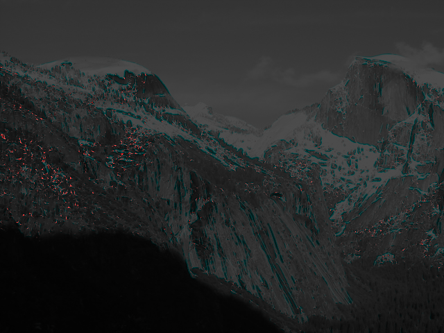

### 3.2 计算局部最大值

​       仅保留$7×7$范围内最大值，作为特征点

```python
width, height = harrisImage.shape[:2]
harrisImage_ = np.pad(harrisImage, ((3, 3), (3, 3)), 'constant')

for i in range(0, width):
    for j in range(0, height):
        if harrisImage_[i + 3, j + 3] == np.max(harrisImage_[i:i+7, j:j+7]):
            destImage[i, j] = True
```

### 3.3 确定特征点
####  3.3.1 确定坐标和方向角
​        通过遍历Harris矩阵，确定特征点的坐标和方向角，存入列表，作为候选特征点，为自适应非极大值抑制做准备

```python
for x in range(width):
    for y in range(height):
        if not harrisMaxImage[x, y]:
            continue
            f = cv2.KeyPoint()
            f.size = 10
            f.pt = (y, x)
            f.angle = orientationImage[x, y]
            f.response = harrisImage[x, y]

            features.append(f)
```

​        根据跟MOPS论文公式所描述的**自适应非极大值抑制（ANMS）**
$$
r_{i}=\min _{j}\left|\mathbf{x}_{i}-\mathbf{x}_{j}\right|, \text { s.t. } f\left(\mathbf{x}_{i}\right)<c_{\text {robust}} f\left(\mathbf{x}_{j}\right), \mathbf{x}_{j} \in \mathcal{I}
$$
​        自适应体现在对于每一个特征点$x_i$都对应一个$r_i$，其响应是半径$r_i$个像素内的最大值（实际中还要乘系数$c_{\text {robust}}$），一般来说，在全部特征点中，一个点的响应越大，其$r_i$一般也越大，抑制周围像素的能力越强。

```python
            def distance(pt1, pt2):
                return np.sqrt((pt1[0]-pt2[0])**2 + (pt1[1]-pt2[1])**2)

            l = len(features)
            local_max = []
            raduis = np.array([99999]*l)
            max_res = 0
            
            for f in features:
                if f.response > max_res:
                    max_res = f.response
                local_max.append(f.response*0.9)
            max_res *= 0.9
            
            for i in range(l):
                res = features[i].response
                if res > max_res:
                    raduis[i] = 99999
                else:
                    for j in range(l):
                        if local_max[j] > res:
                            # print(i, j)
                            d = distance(features[i].pt, features[j].pt)
                            if raduis[i] > d:
                                raduis[i] = d
```

​        通过将存放候选特征点的列表按$r$降序排列，取前$n_{ip}$个$r$较大的候选特征点作为选定的特征点（论文中取$n_{ip}=500$）

```python
            n_ip = 500
            r_sort = np.argsort(raduis)
            rpts = []
            for i in range(l):
                rpts.append(features[r_sort[i]])
            
            return rpts[::-1][:n_ip]
```

​        使用自适应非极大值抑制前后效果对比如下图所示

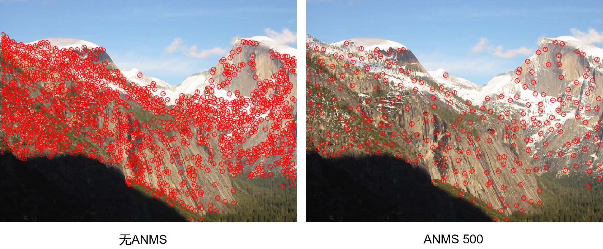

### 3.4 实现简单特征描述符

​        取特征点周围$5×5$大小像素区域，生成一个$25$维向量作为特征描述符

```python
pad = int((5 - 1) / 2)
grayImage_ = np.pad(grayImage, ((pad, pad), (pad, pad)), 'constant')

for i, f in enumerate(keypoints):
    y, x = f.pt
    x, y = int(np.round(x)), int(np.round(y))
    try:
        desc[i] = grayImage_[x: x + 5, y:y + 5].reshape(25)
    except ValueError:
        desc[i] = desc[i] = np.zeros(25)
```

### 3.5 实现MOPS特征描述符

​        对于每一个特征点，根据其坐标位置以及方向角的不同，通过平移、放缩、旋转再平移，最后裁剪，得到一个$8×8$大小的像素块，确定出仿射变换矩阵。

​        实验指导中的做法是先求出4个变换矩阵，然后将矩阵相乘得到仿射变换矩阵，其中的旋转操作$s$矩阵直接进行采样

```python
t1 = np.array([[1., 0., -1. * f.pt[0]], [0., 1., -1. * f.pt[1]], [0., 0., 1.]])
r = np.array([[np.cos(f.angle * np.pi / 180.), np.sin(f.angle * np.pi / 180.), 0.],
              [-1 * np.sin(f.angle * np.pi / 180.), np.cos(f.angle * np.pi / 180.), 0.],
              [0., 0., 1.]])
# 直接采样
s = np.array([[1. / 5., 0., 0.], [0., 1. / 5., 0.], [0., 0., 1.]])
t2 = np.array([[1., 0., 4.], [0., 1., 4.], [0., 0., 1.]])

# 仿射变换矩阵（有放缩）
transMx = t2.dot(s).dot(r).dot(t1)[:2, :]
```

​        而在MOPS论文中对于采样的表述是：“To avoid aliasing, the sampling is performed at a **higher pyramid level**”。 根据论文中的表述，在实际操作中，先不进行直接采样；首先得到一个$64*64$的图像后，再构造高斯金字塔，取$8×8$大小的图像作为特征描述符，这样做可以防止产生混叠。

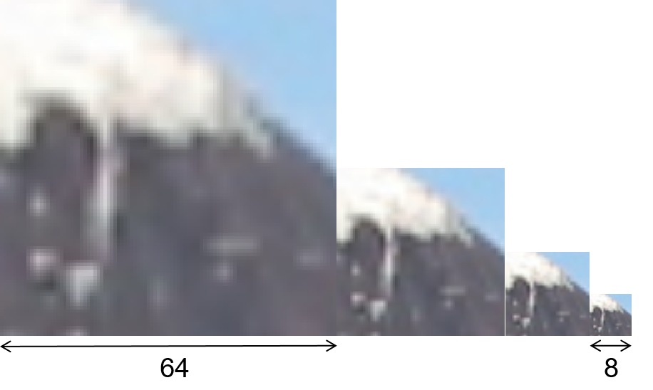

```python
for i, f in enumerate(keypoints):
    t1 = np.array([[1., 0., -1. * f.pt[0]], [0., 1., -1. * f.pt[1]], [0., 0., 1.]])
    r = np.array([[np.cos(f.angle * np.pi / 180.), np.sin(f.angle * np.pi / 180.), 0.],
                  [-1 * np.sin(f.angle * np.pi / 180.), np.cos(f.angle * np.pi / 180.), 0.],
                  [0., 0., 1.]])
    # s = np.array([[1. / 5., 0., 0.], [0., 1. / 5., 0.], [0., 0., 1.]])
    t2 = np.array([[1., 0., 4.], [0., 1., 4.], [0., 0., 1.]])

    # 仿射变换矩阵（无放缩）
    transMx = t2.dot(r).dot(t1)[:2, :]

    destImage = cv2.warpAffine(grayImage, transMx, (64, 64),
                               flags=cv2.INTER_LINEAR, borderMode=cv2.BORDER_REFLECT)
    
    # 进行三次降采样后得到8×8大小的图像
    destImage = cv2.pyrDown(destImage)
    destImage = cv2.pyrDown(destImage)
    destImage = cv2.pyrDown(destImage)
```

​        将$8×8$大小的像素块展开为$64$维的向量，最后将向标准化后作为特征描述符

```python
    destArae = destImage.flatten()
    
    # 标准化
    sig = np.std(destArae)
    if sig <= 1e-5:
        desc[i] = np.zeros(64)
        else:
            desc[i] = ((destArae - np.mean(destArae)) / sig)
```


### 3.6 实现SSD特征匹配

​        计算平方差之和（SSD），即
$$
L=\left\|f_{1}-f_{2}\right\|
$$

```python
matches = []
for i, f1 in enumerate(desc1):
    matche = cv2.DMatch()
    matche.queryIdx = i
    for j, f2 in enumerate(desc2):
        dist = np.sum(np.square(f1 - f2))
            if dist < matche.distance:
                matche.distance = dist
                matche.trainIdx = j
                
    matches.append(matche)
```
### 3.7 实现比例特征匹配

​        计算比率，即最接近的特征匹配的SSD距离除以第二接近的特征匹配的SSD距离
$$
R=\frac{\left\|f_{1}-f_{2}\right\|}{\left\|f_{1}-f_{2}\right\|}
$$

```python
matches = []
for i, f1 in enumerate(desc1):
    distance_list = [(j, np.sum(np.square(f1 - f2))) for j, f2 in enumerate(desc2)]
    distance_list.sort(key=lambda x: x[1])
    d = distance_list[0][1] / distance_list[1][1]
    matche = cv2.DMatch(_queryIdx=i, _trainIdx=distance_list[0][0], _distance=d)
    
    matches.append(matche)
```


## 4. 实验结果

### 4.1匹配结果

**参数设置**

- Threshold: $10^{-4}$

- Percent Matches: $5.0$

- ANMS: $1000$

  

**Bikes数据集**

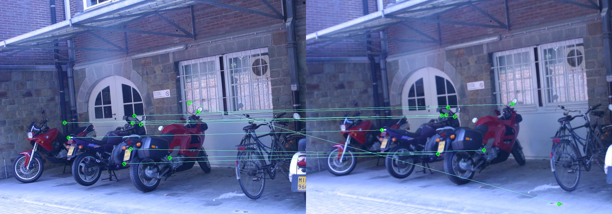


**Graf数据集**

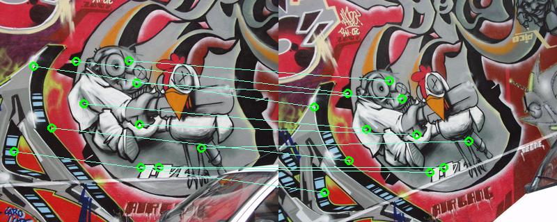


**Leuven数据集**

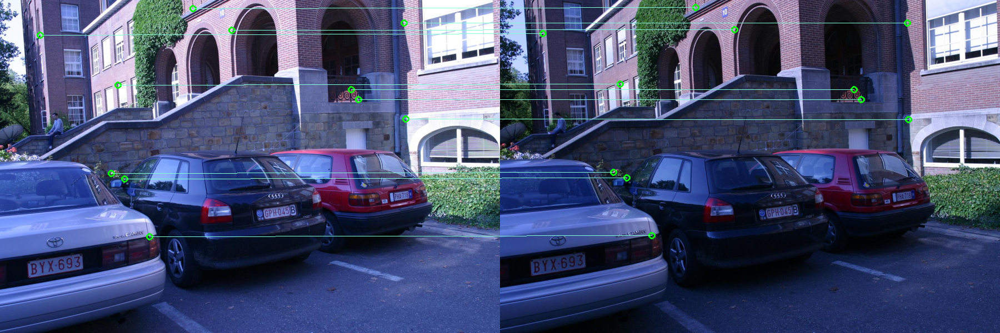


**Wall数据集**

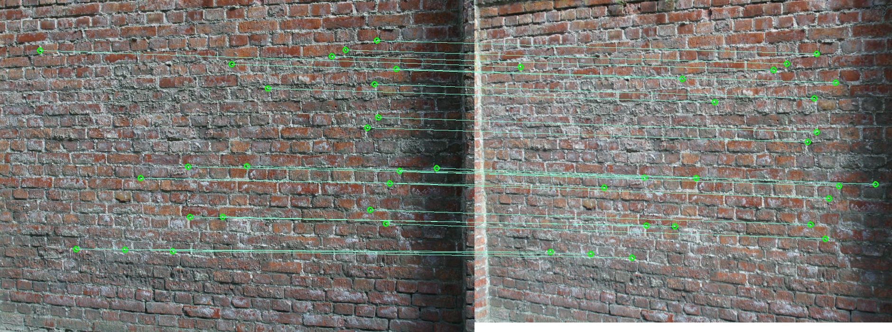


**Yosemite数据集**

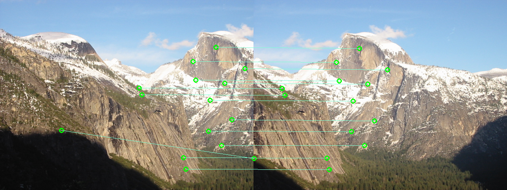


### 4.2 ROC曲线

**参数设置**

- Threshold: $10^{-4}$
- ANMS: $1000$
- Key Point Type: Harris
- Descriptor Type: MOPS
- Matcher Type: Ratio Test

| 数据集 | Bikes | Graf | Leuven | Wall | Yosemite |
| :----: |:----:|:----:|:----:|:----:|:----:|
| **AUC** |0.6457|0.7907|0.8811|0.8568|0.9061|

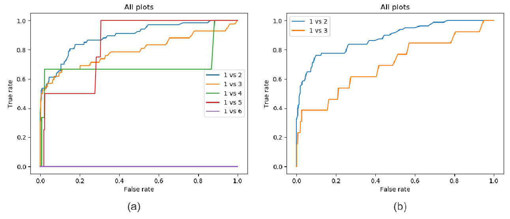

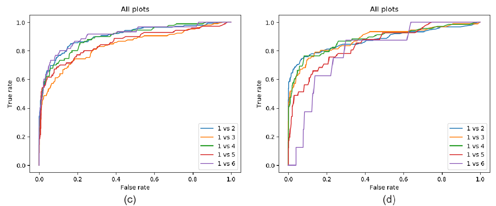

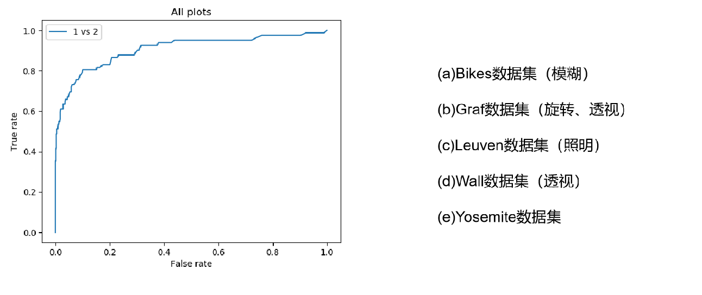

## 5. 问题讨论
### 5.1 Threshold对结果影响

| 数据集 | Bikes | Graf | Leuven | Wall | Yosemite |
| :----: |:----:|:----:|:----:|:----:|:----:|
| **AUC**(Threshold: $10^{-4}$) |0.6457|0.7907|0.8811|0.8568|0.9061|
| **AUC**(Threshold: $10^{-2}$) |0.2467|0.8174|0.8479|0.8771|0.8843|

​        由ROC可知，该算法对于旋转、透视和照明具有一定的稳定性；但是对于模糊（4.2 图a），轻度的模糊仍可以保证较好的结果，**然而随着图片模糊程度越高，由于该算法把角点作为特征点，而角点在模糊处理后的图片中将可能不会被检测出，所以匹配结果较差，提高Threshold反而不利于特征点的检测**。

​        下图展示了对于不同程度的模糊对特征匹配的影响，可以发现图片越模糊，可检测出的特征点（角点）越少。

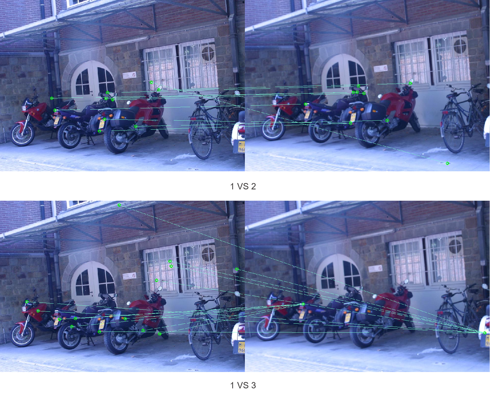

### 5.2 算法对结果的影响

**参数设置1——比较Key Point Type**

- Threshold: $10^{-4}$
- ANMS: $1000$
- **Key Point Type: Harris VS ORB**
- Descriptor Type: MOPS
- Matcher Type: Ratio Test

| 数据集 | Bikes | Graf | Leuven | Wall | Yosemite |
| :----: |:----:|:----:|:----:|:----:|:----:|
| **AUC**(Harris) |0.6457|0.7907|0.8811|0.8568|0.9061|
| **AUC**(ORB) |0.8828|0.6639|0.8536|0.7054|0.9309|

​        由实验结果可以看出，ORB关键点检测算法相较于Harris算法在Bikes数据集（模糊）上有很大改善。


**参数设置2——比较Descriptor Type**

- Threshold: $10^{-4}$
- ANMS: $1000$
- Key Point Type: Harris
- **Descriptor Type: MOPS VS Simple**
- Matcher Type: Ratio Test

| 数据集 | Bikes | Graf | Leuven | Wall | Yosemite |
| :----: |:----:|:----:|:----:|:----:|:----:|
| **AUC**(MOPS) |0.6457|0.7907|0.8811|0.8568|0.9061|
| **AUC**(Simple) |0.4212|0.6876|0.4685|0.6493|0.8950|

​        由实验结果可以看出，MOPS特征描述算法在5个数据集上的表现都优于简单的特征描述算法。


**参数设置3——比较Matcher Type**

- Threshold: $10^{-4}$
- ANMS: $1000$
- Key Point Type: Harris
- Descriptor Type: MOPS
- **Matcher Type: Ratio Test VS SSD**

| 数据集 | Bikes | Graf | Leuven | Wall | Yosemite |
| :----: |:----:|:----:|:----:|:----:|:----:|
| **AUC**(Ratio Test) |0.6457|0.7907|0.8811|0.8568|0.9061|
| **AUC**(SSD) |0.6581|0.7204|0.8102|0.7689|0.8158|

​        由实验结果可以看出，比例测试特征匹配算法在4个数据集上的表现优于SSD特征匹配算法，但在Bikes数据集上稍差于SSD。


## 6. 实验环境

**编程环境**

Python 3.6

**依赖库**

- numpy

- cv2

- scipy

