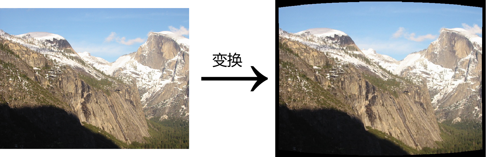

# 实验三 Panorama

## 1. 实验要求

​        首先使用 ORB 特征检测器和描述符检测图像中的特征，并在其他图像中找到最佳匹配特征；然后，使用RANSAC 对齐照片（确定它们的重叠和相对位置），最后将生成的图像混合到一个无缝的全景图中。


## 2. 实验步骤

### 2.1 单应映射变换模型

#### 2.1.1 RANSAC

​        使用ORB特征检测器和描述符检测特征，找到最佳的匹配。每次随机抽取4个匹配对使用奇异值分解（ SVD） 来计算最佳拟合单应映射矩阵$H$。

```python
for i in range(num_matches):
    m = matches[i]
    (a_x, a_y) = f1[m.queryIdx].pt
    (b_x, b_y) = f2[m.trainIdx].pt

# 形成矩阵A，将问题定义为最小二乘问题
A[2 * i, :] = np.array([a_x, a_y, 1, 0, 0, 0, -1 * a_x * b_x, -1 * b_x * a_y, -1 * b_x])
A[2 * i + 1, :] = np.array([0, 0, 0, a_x, a_y, 1, -1 * a_x * b_y, -1 * a_y * b_y, -1 * b_y])

# 奇异值分解 (SVD)
U, s, Vt = np.linalg.svd(A)

if A_out is not None:
A_out[:] = A

H = Vt[-1].reshape((3, 3))
```

​        计算该解的inliers数量

```python
inlier_indices = []
for i in range(len(matches)):
    (x1, y1) = f1[matches[i].queryIdx].pt
    (x2, y2) = f2[matches[i].trainIdx].pt
    a = np.array([[x1], [y1], [1]])
    a_ = np.dot(M, a)

    if a_[-1][0]:
        x3, y3 = a_[0][0] / a_[-1][0], a_[1][0] / a_[-1][0]
        dist = np.sqrt(np.square(x2 - x3) + np.square(y2 - y3))
        if dist < RANSACthresh:
            inlier_indices.append(i)
```

​        重复进行若干次，选择具有最多inliers数的模型。


#### 2.1.2 反向卷绕

​        使用反向卷绕 将每个图像重新映射到其最终位置，待与相邻图像融合。


```python
minX, minY, maxX, maxY = imageBoundingBox(img, M)
width, height = maxX - minX, maxY - minY

x_mesh, y_mesh = np.meshgrid(range(minX, maxX), range(minY, maxY))
grids = np.array([[*pt, 1] for pt in zip(x_mesh.flatten(), y_mesh.flatten())]).T
# 反向卷绕
pre_grids = np.dot(np.linalg.inv(M), grids)  
pre_grids /= pre_grids[-1]

# 将图片映射到通过反向卷绕后坐标中
src = cv2.remap(img, pre_grids[0].reshape(height, width).astype(np.float32),
pre_grids[1].reshape(height, width).astype(np.float32), cv2.INTER_LINEAR)
```

#### 2.1.3 羽化

​        将图片的左右边缘羽化


```python
blend = np.linspace(1, 1 / blendWidth, blendWidth)

w = np.ones(shape=(height, width))
w[:, :blendWidth] = np.flip(blend)
w[:, -1 * blendWidth:] = blend

# 图片左右边缘乘一定权重，达到羽化的效果
dst = np.multiply(src, np.expand_dims(w, -1))
```

#### 2.1.4 叠加

​        将图片依次从左至右叠加到待生成的全景图上，并记录权重和。


```python
acc[minY: maxY, minX: maxX, :3] += dst
acc[minY: maxY, minX: maxX, 3] += np.multiply(w, np.sum(dst, axis=2) > 0)
```

#### 2.1.5 规范化

​        将图片的每一个像素除以权重，使图片规范化。


```python
height, width = acc.shape[:2]
img = np.zeros(shape=(height, width, 3))

for i in range(height):
    for j in range(width):
        if acc[i, j, 3] > 0:
            img[i, j] = acc[i, j, :3] / acc[i, j, 3]
        else:
            img[i, j] = np.array([0, 0, 0])

img = img.astype(np.uint8)
```


### 2.2 平移变换模型

####  2.2.1 变换坐标
​        将每张图片由平面坐标变为球面坐标




```python
xt = np.sin(xf) * np.cos(yf)
yt = np.sin(yf)
zt = np.cos(xf) * np.cos(yf)

xt, yt = xt / zt, yt / zt

r_square = np.square(xt) + np.square(yt)

xt, yt = xt * (1 + k1 * r_square + k2 * np.square(r_square)), yt * (1 + k1 * r_square + k2 * np.square(r_square))
```

#### 2.2.2 RANSAC

​        使用ORB特征检测器和描述符检测特征，找到最佳的匹配。每次随机抽取1个匹配，计算出平移矩阵。

```python
# x 平移量
H[0, 2] = f2[matches_1.trainIdx].pt[0] - f1[matches_1.queryIdx].pt[0]
# y 平移量
H[1, 2] = f2[matches_1.trainIdx].pt[1] - f1[matches_1.queryIdx].pt[1]
```

​        计算该解的inliers数量。（同2.1.1节）

​        重复进行若干次，选择具有最多inliers数的模型。


#### 2.2.3 反向卷绕、羽化、叠加、规范化

​        同2.1节


## 4. 实验结果

### 4.1 Yosemite

**参数设置**

- Motion Model: **Homography / Translation**
- Percent Top Matches for Alignment: 20
- Number of RANSAC Rounds: 500
- RANSAC Threshold: 5.0
- Blend Width (pixels): 200
- 360 degree Panorama: False
- Focal Length: 678
- k1: -0.21
- k2: 0.26


### 4.2 Campus

**参数设置**

- Motion Model: Translation
- Percent Top Matches for Alignment: 20
- Number of RANSAC Rounds: 500
- RANSAC Threshold: 5.0
- Blend Width (pixels): 200
- 360 degree Panorama: **False / True**
- Focal Length: 595
- k1: -0.15
- k2: 0.00


### 4.3 Melbourne

**参数设置**

- Motion Model: **Homography / Translation**
- Percent Top Matches for Alignment: 20
- Number of RANSAC Rounds: 500
- RANSAC Threshold: 5.0
- Blend Width (pixels): 200
- 360 degree Panorama: False
- Focal Length: 720
- k1: 0.00
- k2: 0.00


