#  实验四 Stereo

## 1. 实验要求

​        本实验将运用平面扫描立体视觉与光度测量立体视觉的方法，来恢复图像深 度，并建立立体图。实验包含三个部分： 

- 光度测量立体视觉（详见讲义第 18 讲）：给定在不同的已知光照方向下从相同视角拍摄的一组图像，从中恢复物体表面的反照率(albedo)和法线方向 (normals)。 

- 平面扫描立体视觉（详见讲义第 16 讲）：给定同一场景从不同的视角拍摄的两幅校准图像，从中恢复出粗略的深度图。 

- 基于泊松方程重建深度图（详见讲义第 18 讲）：根据法线图及粗略深度图，恢复出物体每个点的深度，并重建 3D 网格。 


## 2. 实验结果

### 2.1 光度测量立体视觉

#### 2.1.1 tentacle数据集

tentacle_normals.png

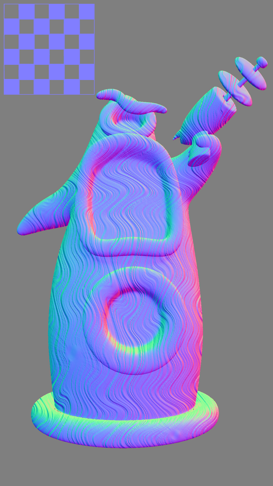

tentacle_albedo.png 

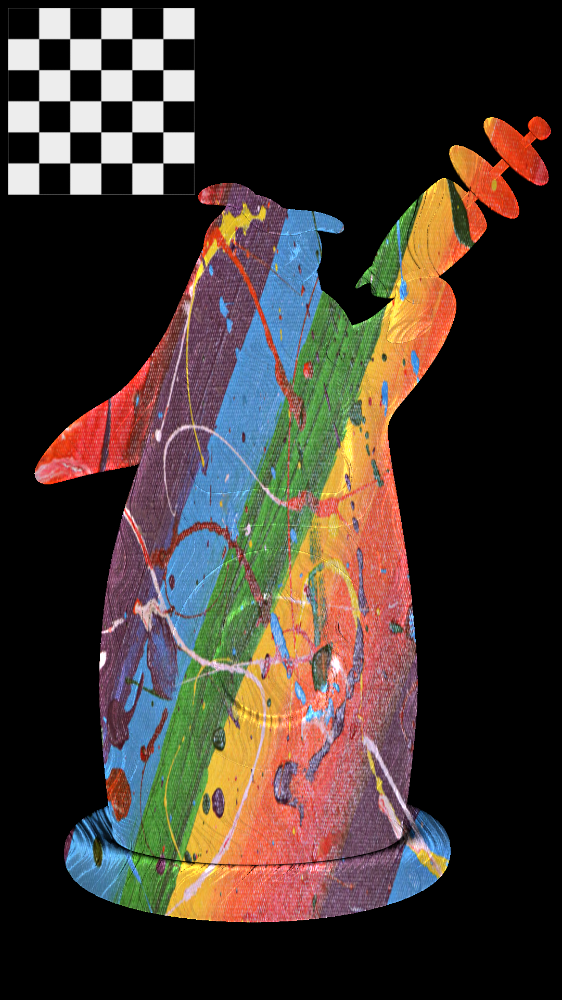


#### 2.1.2 cat数据集

cat_normals.png


cat_albedo.png


### 2.2 平面扫描立体视觉

#### 2.2.1 tentacle数据集

tentacle_{ncc.png,ncc.gif, projected.gif}

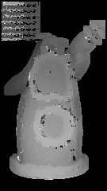 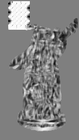 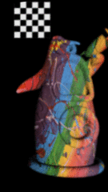

#### 2.2.1 Flowers数据集

Flowers_{ncc.png,ncc.gif, projected.gif}

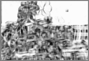 


### 2.3 基于泊松方程重建深度图

#### 2.3.1 tentacle数据集

both模式

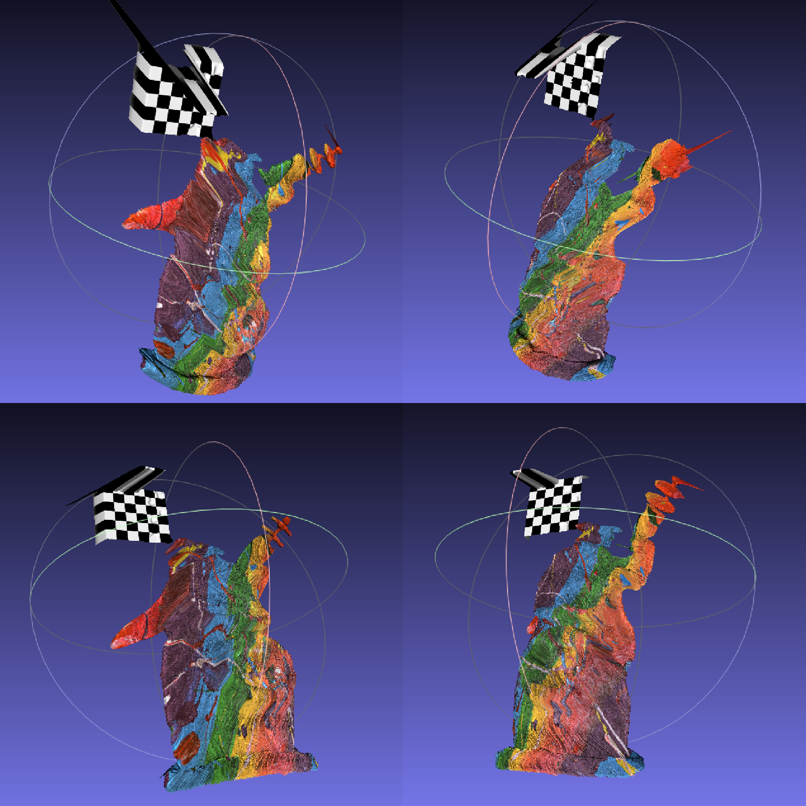


depth模式

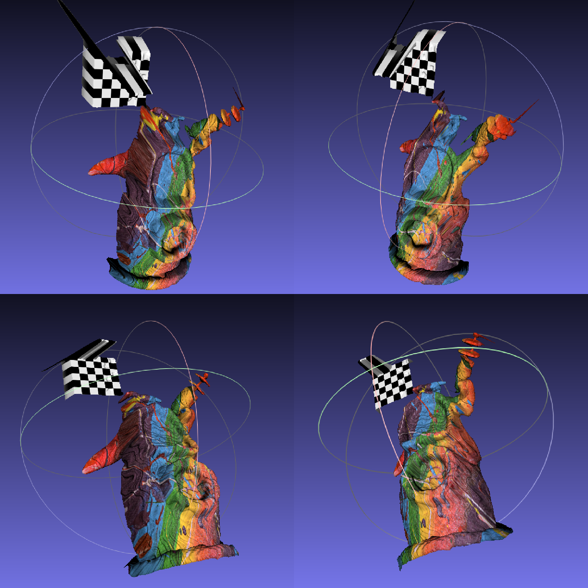


#### 2.3.2 cat数据集

normals模式

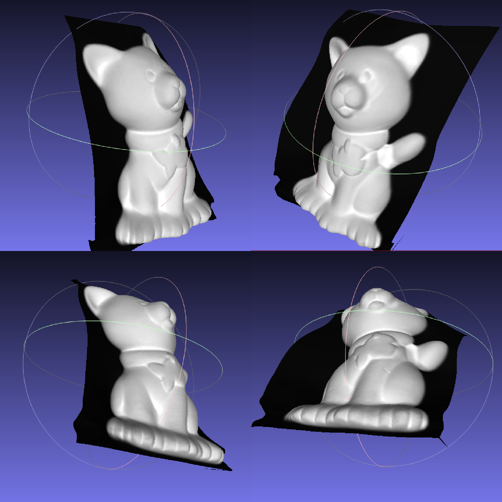


#### 2.3.3 Flowers数据集

depth模式

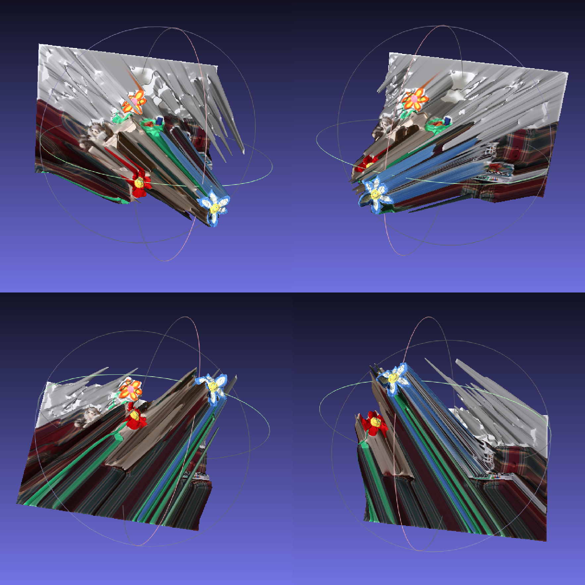


#### 2.3.4 总结分析

##### 问题1

tentacle数据集结果头部一处位置有些失真。原因猜测是这个区域下面一部分体积遮挡住了头部，这种前后遮挡的关系难以捕捉到，加上颜色的变化更容易产生混淆。

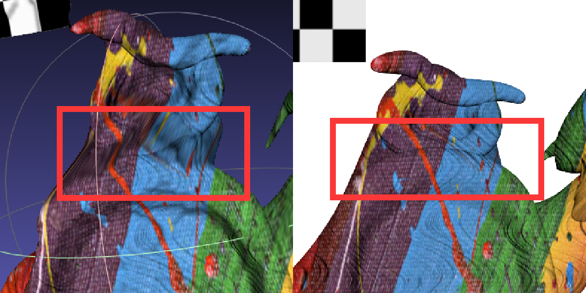

##### 问题2

tentacle数据集结果黑白网格区域有拉伸现象。原因猜测是left文件夹中原图片本身黑白网格具有缺角造成的。

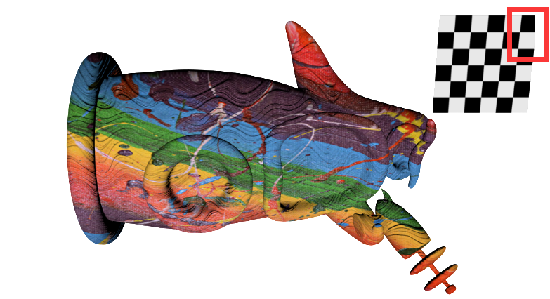

##### 问题3

Flowers数据集结果花的效果尚可，木屋重建效果很差，而且墙面产生大量噪声。原因猜测是木屋中的影子干扰了深度的计算，花在墙上的影子，使算法误以为墙面不是平面。


## 3. 其他问题

使用python3，dataset.py 中PSDataset类_parse_K方法仍有bug

```python
def _parse_K(self, string):
    assert string[0] == '['
    assert string[-1] == ']'
    string = string[1:-1]
    lines = string.split(';')
    assert len(lines) == 3
    lines = map(lambda x: map(float, x.strip().split()), lines)
    return np.array(lines)
```

调用这个方法时，输出的结果并不是所期望的维度为$3×3$的`ndarray`，引发报错

```
IndexError: too many indices for array
```

故检查 `numpy.array`的原始定义，发现object必须为`array_like`

```python
def array(p_object, dtype=None, copy=True, order='K', subok=False, ndmin=0): # real signature unknown; restored from __doc__
    """
        ...
        Parameters
        ----------
        object : array_like
            An array, any object exposing the array interface, an object whose
            __array__ method returns an array, or any (nested) sequence.
        ...
    """
```

关于`array_like`，中这篇[回答](https://stackoverflow.com/questions/40378427/numpy-formal-definition-of-array-like-objects)中给出了详细的解释，于是将_parse_K方法改为

```python
def _parse_K(self, string):
    assert string[0] == '['
    assert string[-1] == ']'
    string = string[1:-1]
    lines = string.split(';')
    assert len(lines) == 3
    lines = list(map(lambda x: list(map(float, x.strip().split())), lines))
    return np.array(lines)
```


# 4. 实验环境

- 操作系统：Windows 10
- Python 3.6
